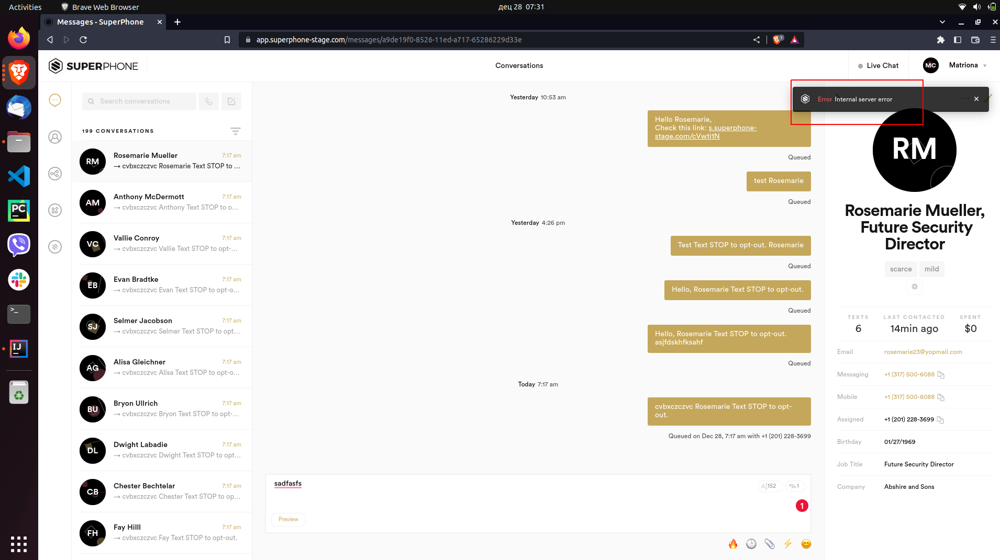
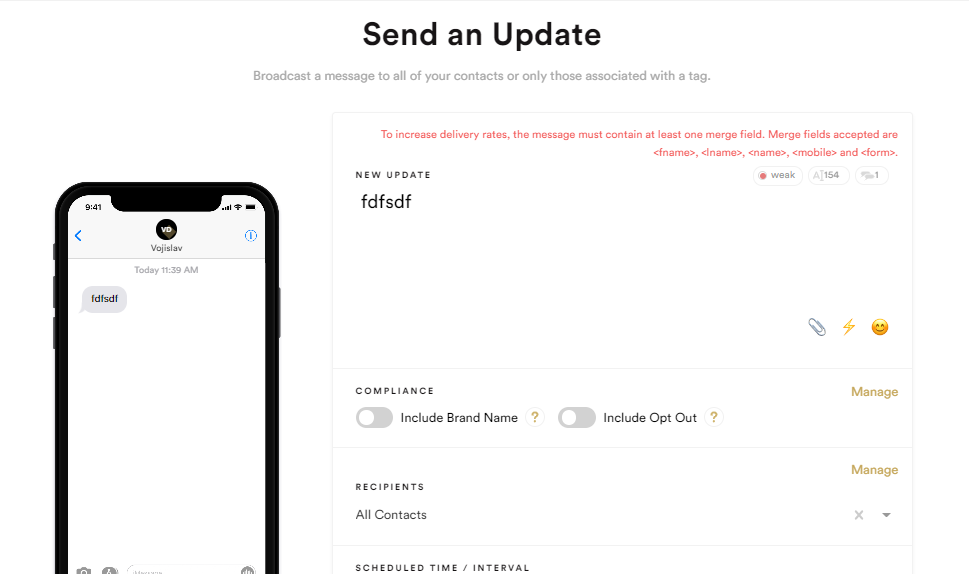

# [29-12-2022]-Regression_execution

* [passed] @Ognjen User is able to create new tag successfully with `string`

    * Open [superphone app](https://app.superphone-stage.com/login)

    * Insert valid Email

    * Insert valid Password

    * Click on `LOGIN` button

    * Navigate on `Tags` page

    * Click on `New` button

    * ==> modal `New Tag` displayed

    * Insert string

    * Click `SAVE` button

    * ==> `Tag` is created

* [passed] @Ognjen  User is able to `delete` tag/tags successfully

    * Open [superphone app](https://app.superphone-stage.com/login)

    * Insert valid Email

    * Insert valid Password

    * Click on `LOGIN` button

    * Navigate on `Tags` page

    * Select tag you want to delete

    * Click on `Delete` button

    * ==> modal `Delete Tags` displayed

    * Click `CONFIRM` button

    * ==> `CONFIRM` button is on the right side

    * ==> `Tag` is removed

    * Click and select more tags you want `delete`

    * Click on `Delete` button

    * ==> modal `Delete Tags` displayed

    * Click `CONFIRM` button

    * ==> `CONFIRM` button is on the right side

    * ==> `Tags` are removed

* [passed] @Ognjen  User is able to `rename` tag successfully

    * Open [superphone app](https://app.superphone-stage.com/login)

    * Insert valid Email

    * Insert valid Password

    * Click on `LOGIN` button

    * Navigate on `Tags` page

    * Select tag which want to rename

    * Click on `Rename` button

    * ==> modal `Rename Tag` displayed

    * Insert `New Tag Name`

    * Click `CONFIRM` button

    * ==> `CONFIRM` button is on the right side

    * ==> `Tag` is renamed

* [passed] @Ognjen  User is able to `Combine` tag successfully

    * Open [superphone app](https://app.superphone-stage.com/login)

    * Insert valid Email

    * Insert valid Password

    * Click on `LOGIN` button

    * Navigate on `Tags` page

    * Select two or more tags which want to combine

    * Click on `Combine` button

    * ==> modal `Combine Tags` displayed

    * Insert `New Tag Name`

    * Click `CONFIRM` button

    * ==> `CONFIRM` button is on the right side

    * ==>`Tags` are combined

* [passed] @Ognjen  User is able to edit contact (Nickname)

    * PRECONDITION:

    * ==> User already has some contacts

    * =========================

    * Open [Superphone app](https://app.superphone-stage.com)

    * Insert valid Email

    * Insert valid Password

    * Click on `LOGIN` button

    * Navigate to `Contacts` page

    * Select one contact from the list

    * Click on Edit button

    * Insert string in `NICKNAME` field

    * Click on `SAVE` button

    * ==> Contact is edited

    * ==> Nickname is displayed

* [passed] @Ognjen  User is able to `Archive` contact

    * PRECONDITION:

    * ==> User already has some contacts

    * =========================

    * Open [Superphone app](https://app.superphone-stage.com)

    * Insert valid Email

    * Insert valid Password

    * Click on `LOGIN` button

    * Navigate to `Contacts` page

    * Select one contact from the list

    * Click on `Actions` dropdown menu and choose `Archive`

    * ==> `Archive Contact` is opened

    * Click on `ARCHIVE` button

    * ==> Selected contact is archived

* [passed] @Ognjen User is able to `Delete` contact

    * PRECONDITION:

    * ==> User already has some contacts

    * =========================

    * Open [Superphone app](https://app.superphone-stage.com)

    * Insert valid Email

    * Insert valid Password

    * Click on `LOGIN` button

    * Navigate to `Contacts` page

    * Selected one contact from the list

    * Click on `Actions` dropdown menu and choose `Delete`

    * ==> `Delete Contact` is opened

    * Click on `DELETE` button

    * ==> New `Delete Contact` modal is opened

    * ==> Question is displayed `Do you want to delete the selected contact?`

    * Click on `CONFIRM`

    * ==> Contact is deleted

    * ==> List of contacts is reduced

* [passed] @Ognjen  User is able to edit segment - Change value in dropdown menu `Filters`

    * Open [superphone app](https://app.superphone-stage.com/login)

    * Insert valid Email

    * Insert valid Password

    * Click on `LOGIN` button

    * Navigate to `Dynamic Segments` page

    * Click on `Edit` button

    * Change value in dropdown menu `Filters`

    * Click `SAVE` button

    * ==> Value in dropdown menu `Filters` is changed

* [failed] @Ognjen User is able to create a `New` form
    
    * Open [superphone app](https://app.superphone-stage.com/segments)

    * Insert valid Email

    * Insert valid Password

    * Click on `LOGIN` button

    * Navigate on `Phone Numbers` page

    * Click on `New` button

    * ==> modal `New Phone Number` is displayed

    > Test is not complete, last step is missing, screenshot is the last written step 

* [passed]  @matriona User is able to `Disable Routing` for phone number

    * Open [superphone app](https://app.superphone-stage.com/login)

    * Insert valid Email

    * Insert valid Password

    * Click on `LOGIN` button

    * Navigate on `Phone Numbers` page

    * Click on `Actions`

    * Click on `Disable Routing`

    * ==> Modal `Disable Routing` is displayed

    * Click `DISABLE`

    * ==> The `phone number` is disabled
    * > Phone number is disabled 

* [failed]  @matriona User is able to create a `New` form with insert value at `SuperPhone URL`

    * Open [superphone app](https://app.superphone-stage.com/login)

    * Insert valid Email

    * Insert valid Password

    * Click on `LOGIN` button

    * Navigate on `Forms` page

    * Click on `New` button

    * ==> `New Form` page is opened

    * Insert value in `SuperPhone URL` field, ex. http://example.com

    * Click `SAVE` button

    * ==> Form is created `SuccessForm created successfully`

    * ==> `SAVE` button is on the right side
    * > Error message "Domain is not valid or already exists" 

* [passed] @matriona User is able to create a `New` form with empty field in `Form Submission`

    * Open [superphone app](https://app.superphone-stage.com/login)

    * Insert valid Email

    * Insert valid Password

    * Click on `LOGIN` button

    * Navigate on `Forms` page

    * Click on `New` button

    * ==> `New Form` page is opened

    * Insert correct string in `SuperPhone URL`

    * `Form Submission` field empty

    * Click on `SAVE`

    * ==> Form is created `SuccessForm created successfully`

    * ==> `SAVE` button is on the right side

* [passed] @matriona User is able to `Disable`/`Enable` Forms

    * Open [superphone app](https://app.superphone-stage.com/login)

    * Insert valid Email

    * Insert valid Password

    * Click on `LOGIN` button

    * Navigate on `Forms` page

    * ==> `Forms` page is opened

    * Click `Disable` button

    * ==> Form is changed on `Enable`

    * ==> `Enable` button is on the right side

    * Click `Enable` button

    * ==> Form is changed on `Disabled`

    * ==> `Disabled` button is on the right side

* [passed]  @matriona User is able to edit `Form`

    * Open [superphone app](https://app.superphone-stage.com/login)

    * Insert valid Email

    * Insert valid Password

    * Click on `LOGIN` button

    * Navigate on `Forms` page

    * ==> `Forms` page is opened

    * Click on `Edit` button

    * Make edit

    * Click on `SAVE` button

    * ==> Form is edited `SuccessForm created successfully`

    * ==> `SAVE` button is on the right side

* [passed] @matriona User is able to search archived conversation

    * PRECONDITION:

    * ==> User already has some archived conversation

    * =====================================

    * Open [superphone app](https://app.superphone-stage.com)

    * Insert valid Email

    * Insert valid Password

    * Click on `LOGIN` button

    * Navigate to `Conversation` page

    * Click on `Strawberry Menu icon`

    * Choose `Archived Conversation`

    * Click on `results` at the bottom

    * ==> Archived conversations are displayed on the page

* [passed] @matriona User is able to send message

    * Open [superphone app](https://app.superphone-stage.com)

    * Insert valid Email

    * Insert valid Password

    * Click on `LOGIN` button

    * ==> User is logged in

    * Click on `Compose Message icon`

    * ==> Message Contacts window pop out

    * Choose contact by name or number

    * Enter message text

    * ==> `SEND` button is enabled

    * Click on `Send` button

    * ==> Success message displayed

* [failed] @matriona User is able to send schedule message

    * Open [superphone app](https://app.superphone-stage.com)

    * Insert valid Email

    * Insert valid Password

    * Click on `LOGIN` button

    * ==> User is logged in

    * Click on `Compose Message icon`

    * ==> Message Contacts window pop out

    * Choose contact by name or number

    * Enter message text

    * Click on `Scheduled` option

    * ==> Date and time are displayed

    * Chose time 2 minutes in advance from current time

    * Click on `Send` button

    * ==> Message is displayed in conversations at the specified time
  * > Error message "Internal Server Error" 

* [passed]  @matriona User is able to archive conversation

    * PRECONDITION:

    * ==> User already has some conversation

    * =====================================

    * Open [superphone app](https://app.superphone-stage.com)

    * Insert valid Email

    * Insert valid Password

    * Click on `LOGIN` button

    * Navigate to conversation page

    * Choose conversation and click on `ACTIONS`

    * ==> Dropdown menu is displayed

    * Click on `Archive`

    * ==> Archive conversation modal window pop out with "Do you want to archive the selected conversations?" text

    * Click on `ARCHIVE` button

* [passed]  @matriona User is able to delete segment

    * Open [superphone app](https://app.superphone-stage.com/login)

    * Insert valid Email

    * Insert valid Password

    * Click on `LOGIN` button

    * Navigate to `Dynamic Segments` page

    * Click on `Delete` button

    * Click on `CONFIRM` button

    * ==> Segment is deleted

* [passed] @vojislav User is able to search `updates` by filter

    * PRECONDITION:

    * ==> User should have Scheduled or Sent updates

    * ======================================

    * Open [superphone app](https://app.superphone-stage.com/segments)

    * Insert valid Email

    * Insert valid Password

    * Click on `LOGIN` button

    * Navigate to `Updates` page

    * Click on `View All Updates` snd select `Sent Updates`

    * ==> User is seeing only sent updates

* [passed] @vojislav User is able to `Send Scheduled Update`

    * Open [superphone app](https://app.superphone-stage.com/segments)

    * Insert valid Email

    * Insert valid Password

    * Click on `LOGIN` button

    * Navigate to `Updates` page

    * Click on `New Update` button

    * In the `Compose your message` field type in some text with merge field

    * On the `Recipients` section choose `All Contacts`

    * On the `Scheduled Time` section choose 1 minute from current time

    * On the `Interval` section choose `Once`

    * Click on the `Save` button

    * Click on the filters `dropdown` and select `Scheduled Updates`

    * ==> Previously scheduled update is visible

* [passed] @vojislav User is able to `Edit Scheduled Update`

    * <b>PRECONDITION:

    * ==> User should have Scheduled Update

    * =================================

    * Open [superphone app](https://app.superphone-stage.com/segments)

    * Insert valid Email

    * Insert valid Password

    * Click on `LOGIN` button

    * Navigate to `Updates` page

    * Click on `All Updates` and select `Scheduled Updates`

    * Find previously created update and click on it

    * Click on the `Edit Update` button

    * Edit `Compose your message` field and click on the `Save` button

    * Click on the first update

    * ==> Scheduled update message is edited

* [failed] @vojislav User is able to `Delete Scheduled Update`

    * Open [superphone app](https://app.superphone-stage.com/segments)

    * Insert valid Email

    * Insert valid Password

    * Click on `LOGIN` button

    * Navigate to `Updates` page

    * Click on `New Update` button

    * In the `Compose your message` field type in some text

    * On the `Recipients` section choose `All Contacts`

    * On the `Scheduled Time` section choose 1 minute in the future

    * On the `Interval` section choose `Once`

    * Click on the `Save` button

    * Click on `All Updates` and select `Scheduled Updates`

    * Find previously created update and click on it

    * Click on the `Delete Update` button

    * Edit `Confirm` button

    * ==> `Scheduled Update` is deleted
    > 

* [passed] @vojislav User is able to change lastname

    * Open [superphone app](https://app.superphone-stage.com/login)

    * Insert valid Email

    * Insert valid Password

    * Click on `LOGIN` button

    * Navigate to `Profile` page

    * Rename `LASTNAME` field

    * CLick on `SAVE` button

    * ==> Lastname renamed in list

* [passed] @vojislav User is able to add value in `FIRST NAME` field of `Dynamic vCard` section

    * Open [superphone app](https://app.superphone-stage.com/login)

    * Insert valid Email

    * Insert valid Password

    * Click on `LOGIN` button

    * Navigate to `Profile` page

    * Insert value in `FIRST NAME` field, f.ex.`John`

    * Click `SAVE` button

    * ==> Value `John` is displayed in `FIRST NAME` field

* [passed] @vojislav User is not able to login successfully - empty email and password

    * Open [superphone app](https://app.superphone-stage.com)

    * Leave Email and Password fields empty

    * Click on `LOGIN` button

    * ==> User should not be logged in

    * ==> Message `Required field` should be shown above both inputs

* [passed] @vojislav User is able to create new segment

    * Open [superphone app](https://app.superphone-stage.com/login)

    * Insert valid Email

    * Insert valid Password

    * Click on `LOGIN` button

    * Navigate to `Dynamic Segments` page

    * Click on `+ New` button

    * Insert value in `SEGMENT NAME` field

    * Click on dropdown menu `Add filter` and select one element

    * Click on dropdown menu `Add filter` and select one more element

    * ==> `SAVE` button is on the right side

    * Click on `SAVE` button

    * ==> New element is added to list

* [passed] @vojislav User is able to create new widget with only `WIDGET NAME` field parameter

    * Open [superphone app](https://app.superphone-stage.com/login)

    * Insert valid Email

    * Insert valid Password

    * Click on `LOGIN` button

    * Navigate to `Widgets` page

    * Click on `+ New` button

    * Insert value in `WIDGET NAME` field

    * Click on `SAVE` button

    * ==> Created widget is added to list

    
